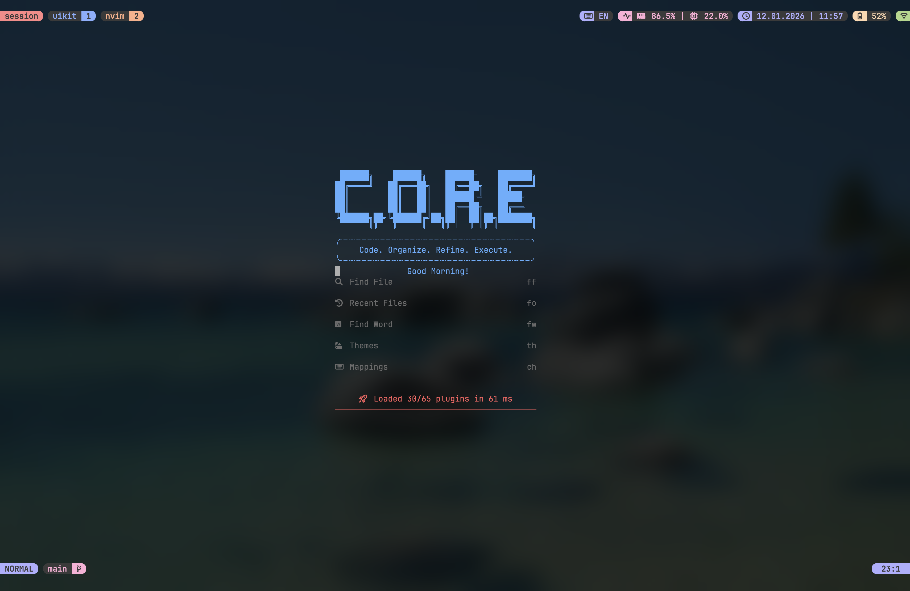
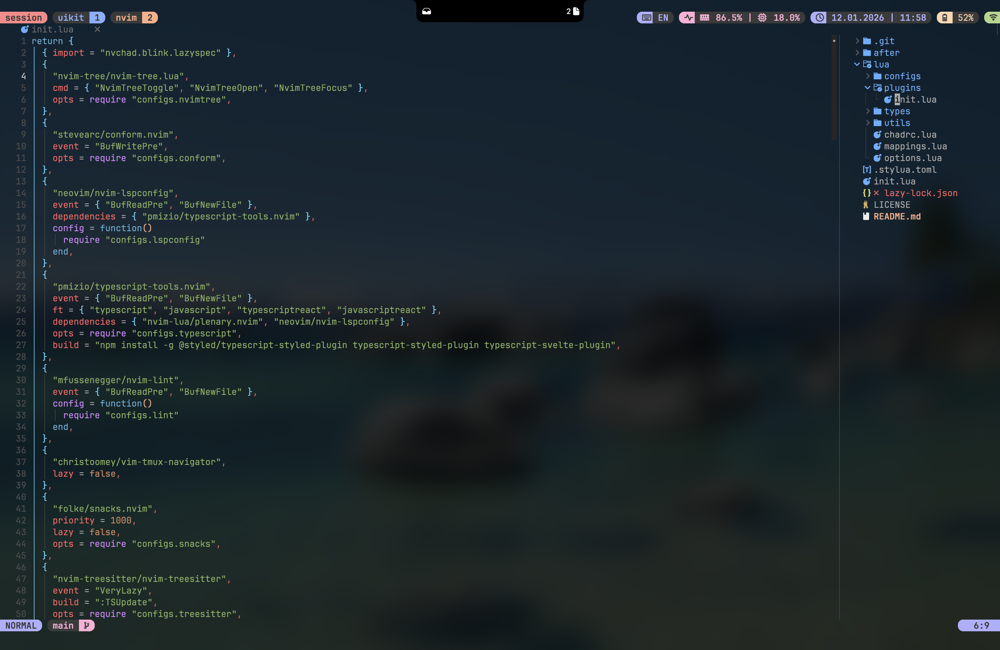
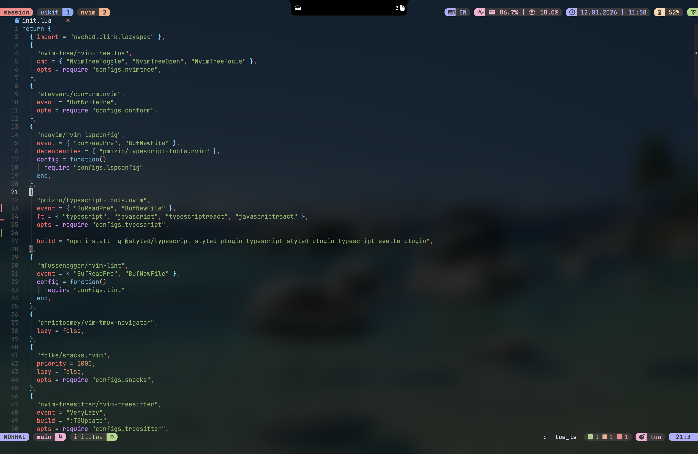

# Neovim config for web development

> [!WARNING]
> This configuration is **no longer maintained**. I have migrated to a new setup based on `vim.pack` and native LSP.
> Please use [Pepetka/nvim-config](https://github.com/Pepetka/nvim-config) instead.

My personal Neovim setup for professional web development. Built on top of [NvChad](https://github.com/NvChad/NvChad) and lives entirely in `~/.config/nvim`.

## Key features

- **TypeScript/JavaScript support** - completion, formatting, linting, debugging, and test runs.
- **AI assistance** - Codeium via `neocodeium`, plus OpenAI tools (`ChatGPT.nvim` and `gen.nvim`) for chat, generation, and edits.
- **Typed plugin configs** - strict options typing in Lua with `---@type`.
- **Upgraded UI** - statusline, tabs, popups, notifications, and progress indicators.
- **Developer UX** - navigation helpers, Git integration, extra nvim-tree features, and more.
- **Broad language coverage** - TypeScript, JavaScript, HTML, CSS, JSON, Markdown, Lua, and others.
- **CSS modules, Tailwind, CSS-in-JS** - syntax highlighting and CSS completion inside stylesheets and components.

## Screenshots





## Structure

The config follows the NvChad layout:

```txt
~/.config/nvim
├── after/
│   ├── queries/
│   │   ├── typescript/  # Extra language injections for typed CSS-in-JS
├── lua/
│   ├── configs/         # Custom plugin configs
│   ├── plugins/         # Plugin initialization
│   ├── types/           # Plugin option typings
│   ├── utils/           # Utility helpers
│   ├── chadrc.lua       # NvChad config
│   ├── mappings.lua     # Key mappings
│   └── options.lua      # General options
├── init.lua             # Entry point
└── …
```


## Installation

```bash
# Replace your current Neovim config:
mv ~/.config/nvim ~/.config/nvim.backup
git clone https://github.com/Pepetka/nvchad-config ~/.config/nvim
nvim
```
- Run `:MasonInstallAll` after lazy.nvim finishes installing plugins.
- Remove `.git` from the `~/.config/nvim` folder if you want to detach from the repo.

## Dependencies

For full `css-in-js` completion support (e.g., styled-components / Emotion), install the following packages globally:

```bash
npm install -g @styled/typescript-styled-plugin typescript-styled-plugin
```

## License

This project is released under **Unlicense**. You can use, copy, modify, and distribute this code without restrictions. See [LICENSE](./LICENSE) or [unlicense.org](https://unlicense.org).
